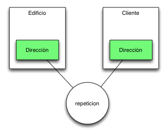
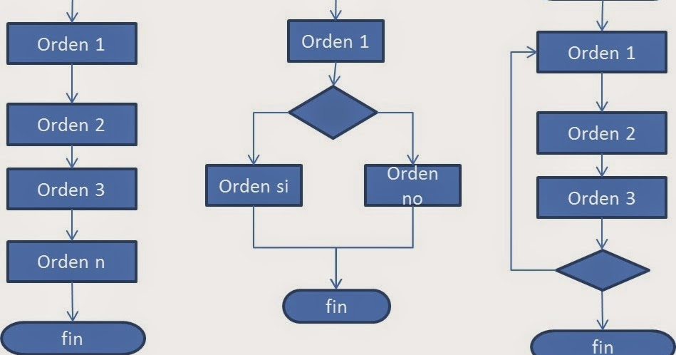

**Definicion de Paradigma**
-Se denominan paradigmas de programación a las formas de clasificar los lenguajes de programación en función de sus características.   
Los idiomas se pueden clasificar en múltiples paradigmas.  

-Algunos paradigmas se ocupan principalmente de las implicancias para el modelo de ejecución del lenguaje, como permitir efectos  secundarios o si la secuencia de operaciones está definida por el modelo de ejecución. Otros paradigmas se refieren principalmente a  a forma en que se organiza el código, como agrupar un código en unidades junto con el estado que modifica el código. Sin embargo,  
otros se preocupan principalmente por el estilo de la sintaxis y la gramática. 

-Programacion Orientada a Objetos
La Programación Orientada a Objetos (POO) es un paradigma de programación, es decir, un modelo o un estilo de programación que nos da  
unas guías sobre cómo trabajar con él. Se basa en el concepto de clases y objetos. Este tipo de programación se utiliza para  
estructurar un programa de software en piezas simples y reutilizables de planos de código (clases) para crear instancias individuales  
de objetos.

-**Primer lenguaje de POO**
SmallTalk, por Alan Kay en Xerox PARC.

-La *abstraccion* es identificar las caracteristicas y las funciones que tiene un objeto y que se representan en clases con atributos
y metodos de esa clase.

-El *encapsulamiento* es una manera de proteger a los objetos de cambios no autorizados y ayuda a la modularidad al programar porque 
al encapsular un objeto puede tratarse como independiente.  

-La *herencia* permite a una clase heredar las propiedades y comportamientos de otra clase(Clase padre).

**UML: DIAGRAMA DE CLASES**
-**Grady Booch** (27 de febrero de 1955) es un diseñador de software, un metodologista de software y entusiasta del diseño de patrones. Es  director científico de Rational Software (ahora parte de IBM) y editor de una serie de Benjamin/Cummings. En 1995 se recibió como  miembro de la Asociación de Maquinaria Computacional (ACM). Fue nombrado socio de IBM en 2003.  
Es más conocido por el desarrollo del Lenguaje Unificado de Modelado (UML), junto con Ivar Jacobson y James Rumbaugh. También  
desarrolló el método Booch de desarrollo de software, el que presenta en su libro Análisis y diseño orientado a objetos. Él aconseja  
la adición de más clases para simplificar códigos complejos.  

-**James Rumbaugh** (22 de agosto de 1947) es un científico de la computación y un metodologista de objeto. Es más conocido por su trabajo  
en la creación de la Técnica de Modelado de Objetos y el Lenguaje Unificado de Modelado (UML). Doctorado en ciencias de la      computación  por el M.I.T.  
Rumbaugh dirigió el desarrollo de la metodología OMT, en el Centro de Investigación y Desarrollo de la General Electric, donde trabajó durante más de 25 años.  
Se unió a Rational Software en 1994, y trabajó allí con Ivar Jacobson y Grady Booch ("los Tres Amigos") para desarrollar UML. Más   tarde fusionaron sus metodologías de desarrollo de software, OMT, OOSE y Booch en el Proceso Unificado Racional (RUP). En el 2003 se 
trasladó a IBM, después de su adquisición de Rational Software. Se retiró en 2006.  

-**Ivar Hjalmar Jacobson** (2 de septiembre de 1939, Ystad - ), es un ingeniero sueco en Ciencias de la computación.  
Inventó el diagrama de secuencia y desarrolló los diagramas de  
colaboración. También impuso el uso de diagramas de estado de transición  
para describir los flujos de mensajes entre los componentes. Fue uno de  
los desarrolladores originales del SDL (lenguaje de especificación), que 
se convirtió en estándar en 1967.

El Lenguaje Unificado de Modelado (UML) desempeña un rol importante no   solo en el desarrollo de software, sino también en los sistemas que no    tienen software en muchas industrias, ya que es una forma de mostrar   
visualmente el comportamiento y la estructura de un sistema o proceso.  

-Existen diversas herramientas para el modelado de sistemas utilizando el  Lenguaje de Modelado Unificado (UML). Algunas de las herramientas más  
 populares incluyen: 

-Enterprise Architect: Es una herramienta de modelado UML completa que   soporta todas las vistas de UML y tiene características avanzadas para la  modelización de sistemas complejos.

-Visual Paradigm: Es una herramienta de modelado UML muy popular que ofrece una amplia gama de características y opciones para el modelado de sistemas.

-IBM Rational Software Architect: Es una herramienta de modelado UML de alta calidad que ofrece una interfaz de usuario intuitiva y soporta múltiples plataformas.

-StarUML: Es una herramienta de modelado UML de código abierto que ofrece una amplia variedad de características para la modelización de sistemas.

-MagicDraw: Es una herramienta de modelado UML muy potente y versátil que soporta todas las vistas de UML y cuenta con características avanzadas para el modelado de sistemas complejos.

-La empresa ITJUANA utiliza UML.

-La máquina dispensadora tiene una clase principal "Máquina dispensadora" que contiene atributos como "pantalla", "teclado" y "ranura de dispensación". También tiene un  método "mostrar opciones" que muestra las opciones de productos disponibles en la pantalla, un método "recibir selección" que recibe la selección del usuario a través del teclado y un método "entregar producto" que dispensa el producto seleccionado en la ranura de dispensación.  

La clase "Producto" representa los diferentes productos disponibles en la máquina dispensadora y tiene atributos como "nombre" y "precio". La clase "Inventario" mantiene un registro de la cantidad de cada producto disponible en la máquina dispensadora.  

La clase "Transacción" representa una transacción de compra de un producto y tiene atributos como "producto seleccionado" y "monto pagado". La clase "Cambio" representa el cambio que debe entregarse al usuario después de la compra y tiene un atributo "cantidad".  